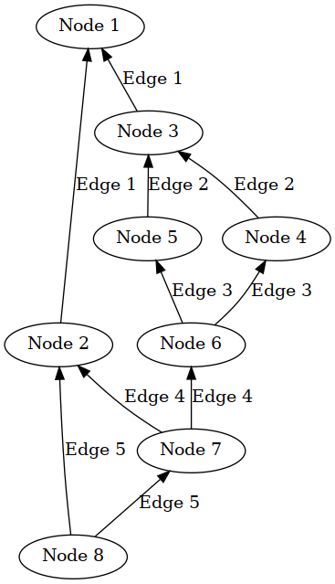
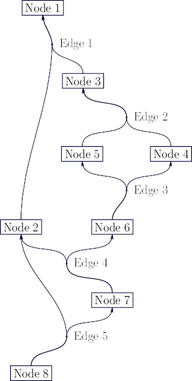

# Hypergraph drawing using Graphviz and Asymptote

## Usage

Requires Python 3 (tested with 3.9.13), [pydot](https://pypi.org/project/pydot/) (tested with 1.4.2), [Asymptote](https://asymptote.sourceforge.io/) (tested with 2.67) and LaTeX (tested with TeX Live 2021).

To render a hypergraph specified in `graph.dot`, execute the following:
```bash
cat graph.dot | dot -Tdot | python3 ./dot_hypergraph_to_asymptote.py /dev/stdin > graph.asy
asy -f png graph.asy
```
You may adjust the font size, width/height of the output and more by editing the values at the beginning of the script.

To embed the graph in a LaTeX document, set `output_latex` to true.
```latex
\usepackage[inline]{asymptote}
% ...
\begin{figure}
  \centering
  \input{output.asy}
  \caption{...}
  \label{fig:...}
\end{figure}
```

## Example

| Original graph | Asymptote rendering |
| -------------- | ------------------- |
|  |  |

`graph.dot`:
```
digraph {
	edge [dir="back"];
	"Node 1" -> "Node 2" [label="Edge 1"]
	"Node 1" -> "Node 3" [label="Edge 1"]
	"Node 3" -> "Node 4" [label="Edge 2"]
	"Node 3" -> "Node 5" [label="Edge 2"]
	"Node 5" -> "Node 6" [label="Edge 3"]
	"Node 4" -> "Node 6" [label="Edge 3"]
	"Node 2" -> "Node 7" [label="Edge 4"]
	"Node 6" -> "Node 7" [label="Edge 4"]
	"Node 2" -> "Node 8" [label="Edge 5"]
	"Node 7" -> "Node 8" [label="Edge 5"]
}
```

## Credits

The generated code is based on https://tex.stackexchange.com/a/108099/185782 by g.kov.

## License

[CC BY-SA 4.0](https://creativecommons.org/licenses/by-sa/4.0/)
 (open an issue if you'd prefer a different license)
